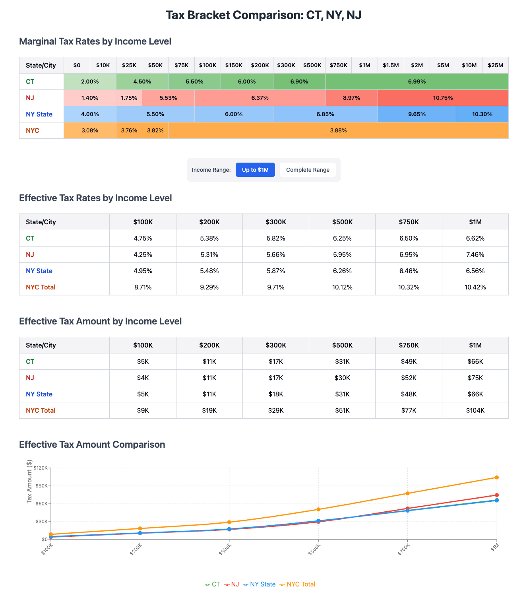
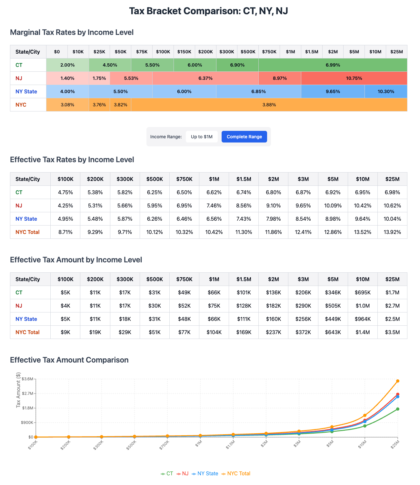

# Tristate Income Tax Comparison

Even though income tax brackets are quite different at first glance between Connecticut, New Jersey, and New York, there isn't much effective difference up to about $750K in total income, after which the effective tax begins to diverge. Living in New York City is significantly costlier due to a separate NYC income tax. (This analysis does not consider sales taxes, which are also higher in NYC compared to CT or NJ.)

----
Notes:
- Tax brackets valid for 2025 filing year
- This is is a simplified analysis for illustrative purposes only. In practice there are many factors to consider which impact the effective tax, such as filing status (single, married, etc.), various deductions and credits available and complex rules applicable in each state, and more.
- The analysis incorporates an $8,000 exemption for single filers

Sources:
- https://taxfoundation.org/data/all/state/state-income-tax-rates/
- https://www.tax.ny.gov/forms/html-instructions/2024/it/it201i-2024.htm#nyc-tax-rate-schedule